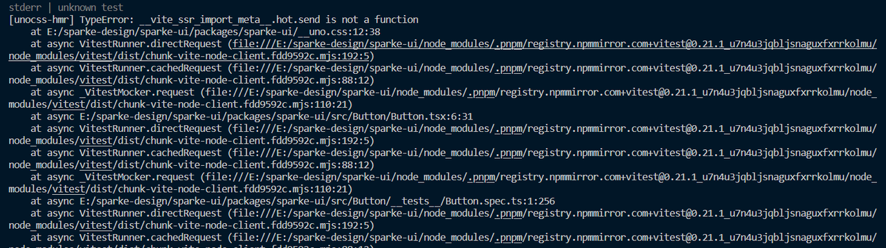
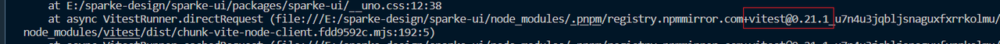
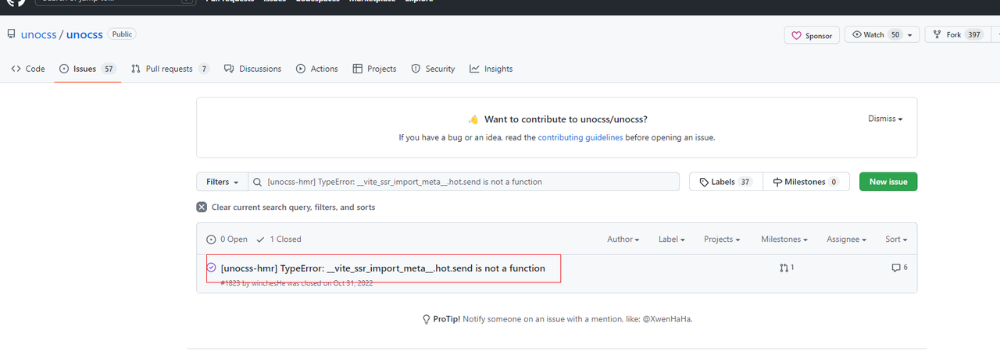
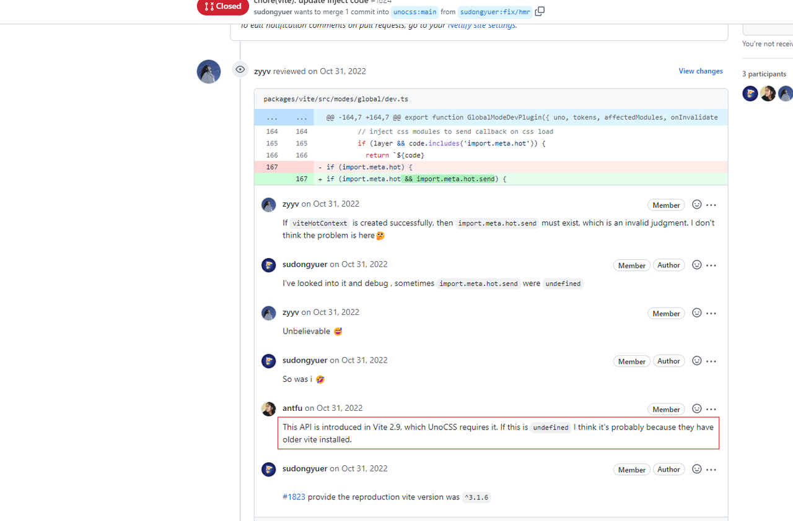
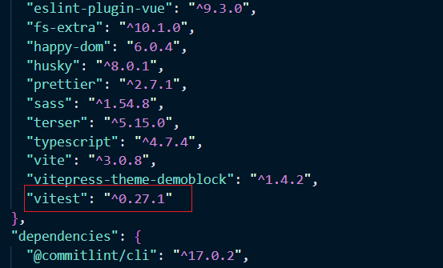
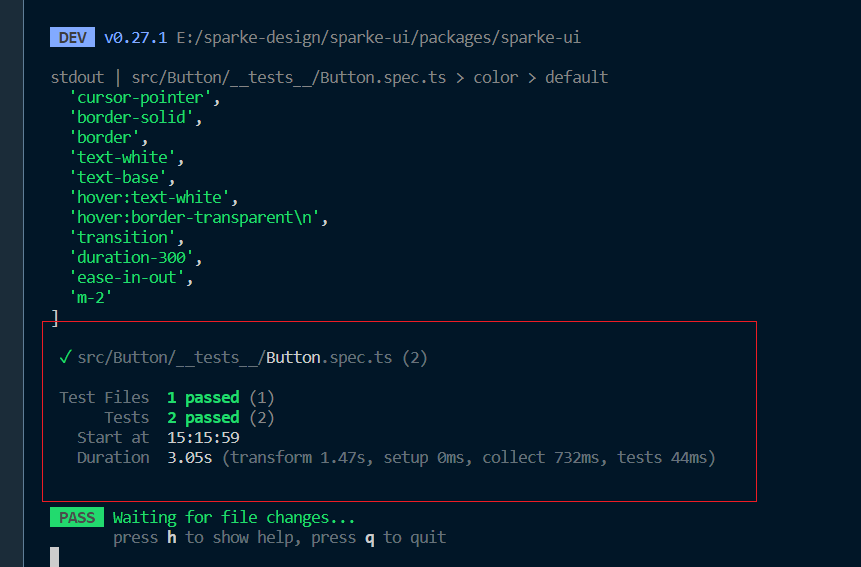

# 01 - 使用 Vitest 进行组件单元测试遇到的问题

## 前言：
>在给 sparke-ui 组件库添加单元测试的时候，由于组件库基于 Vite,故选用了 Vitest 作为单元测试的框架，在进行相应环境搭建后执行代码，发现报错。

 

## 第一步:
> 首先来看这个报错信息，vite_ssr_import_meta.hot 说这个不是一个函数，然后定位在文件uno.css 中，再继续阅读，可以看到后面的报错信息都是与这个 vitest 有关。

## 第二步:
> 遇到问题咋办，那就解决呗，然后开始百度，发现根本找不到这个报错相关的文档。这里引用了 UnoCss 这个库，那么去 github 看看有没人提过 issue 是吧，没有还能自己给他提个。

## 第三步:
>好家伙，果然有人提过这个 issue，那么看看咋解决的，看下面大佬说的可以看到额虽然我英文不行，但大致意思是我认为有可能是他们使用了较老版本的 vite 导致的。

## 第四步:
>好家伙一语惊醒梦中人，我赶紧一看自己的项目报错，里面涉及到 vitest，那么会不会我的 vitest 版本比较老呢，斗胆进行了一波升级操作，pnpm install vitest -D，给他把版本干起来。

## 第五步:
>执行 pnpm test，全剧终！

